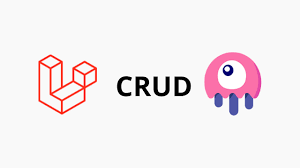

# Laravel-magic-Crud


*If you want to save time on your crud operations*

This Laravel package is for saving time on CRUD operations when used in
combination with Repositories or Services. The trait covers the basics needed
for running simple CRUD operations. It also comes with a Contract that you
can bind to your services via automated contextual binding.

### Docs

-   [Installation](#installation)
-   [Configuration](#configuration)
-   [Generators](#generators)


## Installation
Here is the complete video of the usage and installation of the package.

<a href="https://www.youtube.com/watch?v=TMF2bbvme74" target="_blank">
  
</a>

### Install package

Add the package in your composer.json by executing the command.

```
composer require bushart/crudmagic
```

Next,
add the service provider to `app/config/app.php`

```
bushart\crudmagic\MagicServiceProvider::class,
```

## Configuration

### Publish configuration  files

Laravel 8.\*

```
php artisan vendor:publish --tag=public
```

```
php artisan vendor:publish --tag=config
```

### Namespace for resource controllers

If you wish to set a default namespace for resource controllers use this option.
Which will be used when in silent mode in the resource generator.

```
'default_resource' => 'Admin',
```

## Generators

### Controller Generator

You can generate either a blank controller or a complete resource controller.

```
php artisan magic:controller YourControllerName
```

This will generate the resource controllers with all necessary basic functions
already filled in for you based on the Crudable functionality.

```
namespace App\Http\Controllers;

use Illuminate\Http\Request;
use Exception;
use bushart\crudmagic\CrudHelpers;
use App\Models\YourModelName;

class YourControllerName extends Controller
{
    protected $orders;
    private $data, $params = [];
    private $success = false;
    private $message = '';

    /**
     * Display a listing of the resource.
     *
     * @return \Illuminate\Http\Response
     */
    public function index()
    {
        $this->data['headers'] = $this->headers();

        return view('admin.yourResourceName.index', $this->data);
    }

    /**
     * Show the form for creating a new resource.
     *
     * @return \Illuminate\Http\Response
     */
    public function create()
    {
        return view('admin.yourResourceName.create');
    }

    /**
     * Store a newly created resource in storage.
     *
     * @param  \Illuminate\Http\Request $request
     * @return \Illuminate\Http\Response
     */
    public function store(Request $request)
    {
        $data = $request->all();
        if (!empty($data)) {
            unset($data['token']);
            YourModelName::create($data);
            $this->success = true;
            $this->message = 'Data created successfully';
        }

        return response()->json(['success' => $this->success, 'message' => $this->message]);
    }

    /**
     * Display the specified resource.
     *
     * @param  int $id
     * @return \Illuminate\Http\Response
     */
    public function show($id)
    {
        return view('admin.orders.show');
    }

    /**
     * Show the form for editing the specified resource.
     *
     * @param  int $id
     * @return \Illuminate\Http\Response
     */
    public function edit($id)
    {
        $this->data['data'] = YourModelName::find($id);

        return view('admin.yourResourceName.edit', $this->data);
    }

    /**
     * Update the specified resource in storage.
     *
     * @param  \Illuminate\Http\Request $request
     * @param  int $id
     * @return \Illuminate\Http\Response
     */
    public function update(Request $request, $id)
    {
        $data = $request->all();
        $obj = YourModelName::find($data['id']);
        if (!empty($obj)) {
            $obj->update($data);
            $this->success = true;
            $this->message = 'Data updated successfully';
        }

        return response()->json(['success' => $this->success, 'message' => $this->message]);
    }

    /**
     * Remove the specified resource from storage.
     *
     * @param  int $id
     * @return \Illuminate\Http\Response
     */
    public function destroy($id)
    {
        $obj = YourModelName::find($id);
        if (!empty($obj)) {
            $obj->delete();
            $this->success = true;
            $this->message = 'Data deleted successfully';
        }

        return response()->json(['success' => $this->success, 'message' => $this->message]);
    }

    /**
     * This is use to get data.
     *
     * @param  \Illuminate\Http\Request $request
     * @return \Illuminate\Http\Response
     */
    public function getData(Request $request)
    {
        $this->data = [];
        $this->params = [
            'perPage' => 10, // use to paginate data per page by default it is 10.
            'page' => $request->input('page'),
            'search' => $request->input('search'),
            'sortColumn' => $request->input('sortColumn'),
            'sortType' => $request->input('sortType'),
            'dropDownFilters' => $request->input('dropDownFilters'),
        ];
        $this->data = YourModelName::getData($this->params);

        return response()->json($this->data);
    }


    /**
     * this is use to function create table header name
     *
     * @return array
     */
    protected function headers()
    {
         /*========================================
          Here we use the test header names.
          You can use the header names as you want.

          In the action header, we use false for the sorting because we do not sort on the actions.
          so the headers or the columns you do not want to sort just add false in the third place.
          For example: ['Action', '', false].
          For the header names if they are different from the Order column name, For example:
          The column name in the table is Name and you want to use "Header name 1" in the header so for sorting you should have to add the Order column name.
          Like: ['Header name 1', 'name'],
        ==========================================*/
        $array = [
            ['Header name 1'], ['Header name 2'], ['Action', '', false]
        ];

        return CrudHelpers::generateHeaders($array);
    }
}
```

This of course only covers the very basic functions but saves you from
writing the same boiler plate code over and over again.

If you just need a blank controller with just the services implemented use the
blank option like so:

```
php artisan magic:controller --blank
```

### View Generator

You can generate basic views for create/edit/index based on the Bootstrap
version that shipped with Laravel.

```
php artisan magic:views YourModelName
```

### Resource Generator

If you're starting out fresh you may wish to generate the entire resource
including the model, service, resource controller Route and views .

```
php artisan magic:resource YourResourceName
```


Have fun CRUDding! :-)
